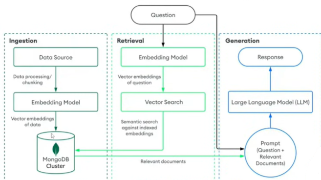

### Overview

This project implements an advanced Retrieval-Augmented Generation (RAG) pipeline that integrates MongoDB Vector Search with large language models (LLMs) to deliver context-aware, fact-grounded responses from unstructured data.
## Workflow

Data Ingestion – Raw documents are collected from multiple sources and loaded into the system.

Preprocessing – Text is cleaned, chunked, and normalized to optimize embedding quality.

Embedding Generation – Each text chunk is converted into a high-dimensional vector using an embedding model.

Vector Storage & Indexing – Embeddings and metadata are stored in MongoDB and indexed using MongoDB Vector Search.

Query Processing – User queries are embedded using the same embedding model.

Similarity Retrieval – MongoDB Vector Search retrieves the most relevant document chunks based on vector similarity and optional metadata filters.

Context Augmentation – Retrieved documents are injected into the LLM prompt.

Response Generation – The LLM generates an accurate, context-aware response grounded in retrieved data.
### Key Features

Document ingestion and preprocessing

Embedding generation using modern embedding models

MongoDB-native vector indexing and similarity search

Context injection into LLM prompts

Hybrid search (vector + keyword) and metadata filtering

Modular and scalable RAG architecture

### Tech Stack

MongoDB Vector Search

Large Language Models (LLMs)

Embedding Models

Python / JavaScript (as applicable)

### Use Cases

Question answering systems

Knowledge assistants

Document search and analysis

Enterprise AI applications

### Outcome
The project demonstrates a production-ready RAG system that improves response accuracy, reduces hallucinations, and enables efficient semantic search over large-scale datasets.

The project demonstrates a production-ready RAG system that improves response accuracy, reduces hallucinations, and enables efficient semantic search over large-scale datasets.
